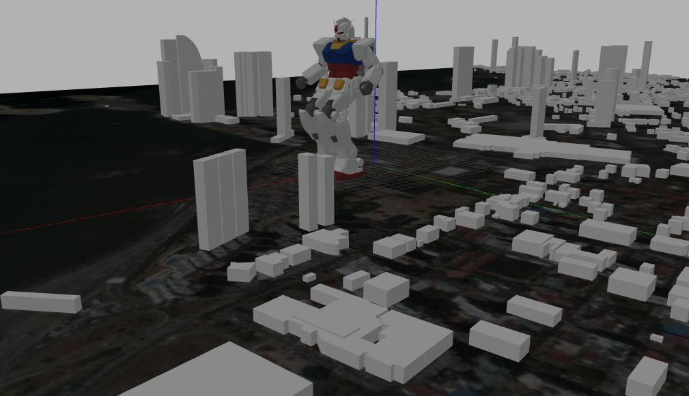
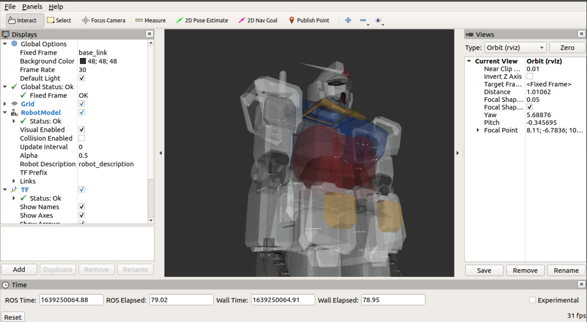
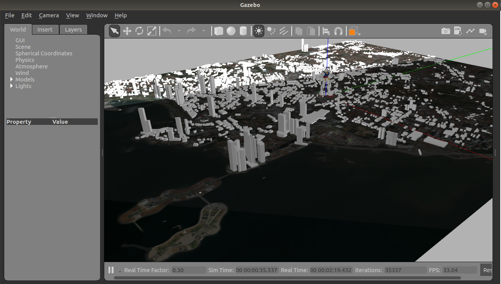

GUNDAM_RX78
========================================================================================================================================================================
Controlar los movimientos del Gundam en un ROS, con la ayuda de otras herramientas como Gazebo.

Pre-requisitos 📋
----------------------
El sistema operativo utilizado es Ubuntu 18.04 Es necesario tener ROS instalado, con el entorno de trabajo configurado. Los pasos para la instalacion y configuració pueden verse en:
```
 http://wiki.ros.org/melodic/Installation/Ubuntu
```

Paquetes de ROS para robots de GUNDAM 

original: https://github.com/gundam-global-challenge/gundam_robot.git





Cómo configurar el espacio de trabajo
----------------------
Con el entorno de trabajo de ROS configurado, se siguieron los pasos del archivo de GUNDAM bajo el apoyo con el archivo alojado en el Github.

```
$ mkdir -p catkin_ws/src
$ cd catkin_ws
$ wstool init src
$ wstool merge -t src https://raw.githubusercontent.com/gundam-global-challenge/gundam_robot/.gundam.rosinstall
$ wstool update -t src
$ source /opt/ros/$ROS_DISTRO/setup.bash
$ rosdep install -y -r --from-paths src --ignore-src
$ catkin build
$ source devel/setup.bash
```

Visualizar modelo URDF
===========================

Se procede a colocar la línea de comando para arrancar el GUNDAM
Archivo URDF en rviz, puede usar el archivo `display.launch`.
```
$ roslaunch gundam_rx78_description display.launch
```




Mapa de Panamá
===========================




Ejecutar la simulación de gazebo
============================

Para ejecutar una simulación de gazebo.

```
$ roslaunch gundam_rx78_gazebo gundam_rx78_world.launch
```

Para controlar los ángulos de las articulaciones
------------

Puede ejecutar un patrón de caminata similar a un "robot" en la simulación

```
$ roslaunch gundam_rx78_gazebo gundam_rx78_walk.launch
```

```
# paso
$ rosrun gundam_rx78_control joint_trajectory_client_csv.py `rospack find gundam_rx78_control`/sample/csv/step.csv
# Caminar hacia adelante
$ rosrun gundam_rx78_control joint_trajectory_client_csv.py `rospack find gundam_rx78_control`/sample/csv/walk-forward.csv
# caminar hacia atrás
$ rosrun gundam_rx78_control joint_trajectory_client_csv.py `rospack find gundam_rx78_control`/sample/csv/walk-backward.csv
# caminar a la derecha
$ rosrun gundam_rx78_control joint_trajectory_client_csv.py `rospack find gundam_rx78_control`/sample/csv/walk-to-right.csv
# caminar a la izquierda
$ rosrun gundam_rx78_control joint_trajectory_client_csv.py `rospack find gundam_rx78_control`/sample/csv/walk-to-left.csv
# Girar a la derecha
$ rosrun gundam_rx78_control joint_trajectory_client_csv.py `rospack find gundam_rx78_control`/sample/csv/turn-right.csv
# Girar a la izquierda
$ rosrun gundam_rx78_control joint_trajectory_client_csv.py `rospack find gundam_rx78_control`/sample/csv/turn-left.csv
```

```
# Levantar los brazos y caminar
$ rosrun gundam_rx78_control joint_trajectory_client_csv.py `rospack find gundam_rx78_control`/sample/csv/up.csv
```


Tengamos en cuenta que actualmente tenemos varias limitaciones en esta simulación, solo tenemos un controlador de posición etc.

También se pueden encontrar archivos de control de movimiento de muestra en el directorio `gundam_rx78_control/sample`.

joint_trajectory_client_csv.py
----------------------

Usando el control de gundam con joint_tajectory_client_csv.py e ingresando un archivo .csv

Este utilizará los patrones indicados en el archivo para simular el movimiento del gundam según los valores de los ángulos de cada componente.

Autores ✒️
----------------------
* Gloris Cedeño		 
* Deyka Jordan 	
* Azael Batista 		
* Isaac Perdomo
* Iván Saavedra		 
* Mario Villarreal
* Samuel Olmedo 	 
* Franger Lezcano
* Elena Linares 		
* Alexis García
* Jorge Muñoz 

Otros comentarios 🎁
----------------------
El gran reto que se tuvo fue evitar que el robot cayese al vacío, apenas se abre el entorno.

video de Youtube: 
----------------------

https://youtu.be/hVrQR7l3-CA
